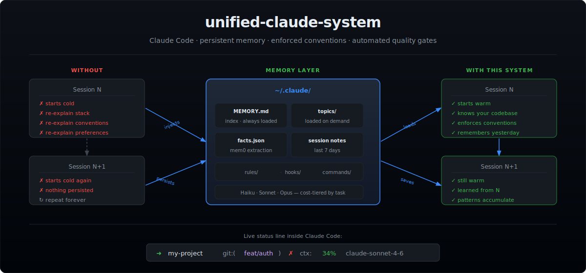

# unified-claude-system

> Claude Code with persistent memory, enforced conventions, 10 context modes, and automated quality gates.
> Every session starts warm — Claude remembers your codebase, your decisions, and what you did yesterday.

[](LICENSE)
[](https://claude.ai/code)

**One-line install (macOS):**
```bash
git clone https://github.com/anhnguyensynctree/unified-claude-system.git ~/.claude
```
→ [Full macOS setup](#macos-setup) · [Windows / WSL2](#windows-setup-via-wsl2)



---

## The Problem

Every Claude Code session starts cold. You re-explain your stack, your conventions, what you built yesterday. The same instructions — every single session.

**This system fixes that.** Drop it into `~/.claude` and Claude becomes a stateful development partner:

- **Persistent memory** — remembers decisions, patterns, and project context across sessions without manual re-briefing
- **Enforced conventions** — rules load automatically via hooks, not trusted to per-prompt engineering
- **14 context modes** — Claude shifts persona and priorities based on what you're doing: dev, test, review, security, debug, plan, ui-ux, architecture, devops, refactor, performance, data, docs, research — each loaded on demand, zero token cost until triggered
- **Automated quality gates** — catches `console.log`, runs TypeScript checks, enforces test coverage in real time
- **Cost-tiered agent dispatch** — Haiku for worker tasks, Sonnet for 90% of coding, Opus for architecture — never overpay
- **Continuous learning** — patterns discovered during work are extracted and reused in future sessions

```
Without this:   "Use pnpm. TDD. Conventional commits. No console.log. 80% coverage minimum."
With this:      Claude already knows. Every session, from the first message.
```

---

## Who Is This For?

- **Claude Code CLI users** tired of re-briefing Claude every session
- **Solo developers** who want a consistent, opinionated AI pair programmer
- **Teams** who want Claude to follow the same conventions across all members
- **Cost-conscious users** — token usage is minimized by design, not afterthought

---

## Directory Structure

```
~/.claude/
├── CLAUDE.md                    ← Global operating instructions (always loaded)
├── settings.json                ← Hook wiring + plugin config + model
├── keybindings.json             ← Custom keyboard shortcuts
├── policy-limits.json           ← Safety constraints
├── statusline-command.sh        ← Custom status line (dir + git branch + ctx%)
│
├── rules/                       ← Domain-specific rules (loaded on demand)
│   ├── coding-style.md          ← File size, naming, quality standards
│   ├── testing.md               ← TDD, 80% coverage, consistency-critical
│   ├── git-workflow.md          ← Conventional commits, branch naming
│   ├── security.md              ← Secrets, injection, immune system pattern
│   ├── performance.md           ← Model selection, token minimization
│   ├── patterns.md              ← API shapes, async, error handling
│   ├── agents.md                ← Delegation, model tiers, dispatch protocol
│   └── hooks.md                 ← Hook reference and documentation
│
├── contexts/                    ← Mode-specific prompts (loaded on demand)
│   ├── dev.md                   ← Implementation mode
│   ├── review.md                ← Code review mode
│   ├── research.md              ← Exploration / investigation mode
│   ├── test.md                  ← QA / test authoring mode
│   ├── ui-ux.md                 ← UI/UX design mode
│   ├── architecture.md          ← System architecture mode
│   ├── plan.md                  ← Sprint / project planning mode
│   ├── security.md              ← Security audit mode
│   ├── debug.md                 ← Debugging / root cause analysis mode
│   ├── devops.md                ← CI/CD / infrastructure / deployment mode
│   ├── refactor.md              ← Refactoring / tech debt reduction mode
│   ├── performance.md           ← Profiling / optimization mode
│   ├── data.md                  ← Data pipelines / ML / analytics mode
│   └── docs.md                  ← Documentation / runbooks / ADR mode
│
├── commands/                    ← Slash command definitions (/command-name)
│   ├── tdd.md                   ← RED → GREEN → IMPROVE workflow
│   ├── commit.md                ← Conventional commit with safety checks
│   ├── plan.md                  ← 5-phase implementation planning
│   ├── scaffold-project.md      ← Full monorepo bootstrap
│   ├── breakdown.md             ← Task decomposition with model tiers
│   ├── fork.md                  ← Context initialization in new session
│   ├── consolidate-memory.md    ← Haiku-powered memory compression
│   ├── review-pr.md             ← Structured PR review
│   ├── e2e.md                   ← E2E test generation
│   ├── debug.md                 ← Systematic debugging workflow
│   ├── learn.md                 ← Pattern extraction
│   ├── standup.md               ← Git log standup report
│   ├── refactor-clean.md        ← Codebase cleanup
│   ├── test-coverage.md         ← Coverage analysis
│   └── update-codemaps.md       ← Codemap regeneration
│
├── hooks/
│   └── memory-persistence/      ◄★ the memory engine lives here
│       ├── session-start.sh     ← Injects context at session open
│       ├── session-end.sh       ← Persists state at session close
│       ├── pre-compact.sh       ← Saves state before context compaction
│       ├── mem0-extract.sh      ← Extracts structured facts from transcripts
│       └── health-check.sh      ← Validates system integrity on every session start
│
├── standards/
│   └── testing-pipeline.md      ← 6-layer test standard for multi-stage pipelines
│
├── skills/
│   ├── continuous-learning/
│   │   ├── SKILL.md             ← Skill definition
│   │   └── evaluate-session.sh  ← Pattern extraction on Stop hook
│   ├── oms.md                   ← One-Man-Show multi-agent orchestration engine
│   ├── oms-train.md             ← Agent persona training workflow
│   ├── compact-agent-memory.md  ← Compress per-agent MEMORY.md files
│   ├── strategic-compact.md
│   └── codemap-updater.md
│
├── handoffs/                    ◄★ session handoff files (one per project per day)
│   └── YYYY-MM-DD-project-session.tmp
│
└── projects/[encoded-path]/memory/   ◄★ per-project persistent memory
    ├── MEMORY.md                ← Always loaded index (<80 lines)
    ├── insights.md              ← Cross-topic patterns from consolidation
    ├── facts.json               ← Structured facts extracted from transcripts
    └── topics/
        ├── agents.md, hooks.md, patterns.md
        ├── scaffold.md, debugging.md, projects.md
        └── archived.md          ← Decayed/contradicted entries (never deleted)
```

---

## ★ Memory Layer — The Core

> Every other component enforces standards. The memory layer is what makes Claude *continuous* — able to carry context, decisions, and learned patterns across sessions without manual re-briefing.

```
Session Start
│
├── MEMORY.md injected (index, <80 lines)
│   └── Topic Index routes full topic files on demand
│
├── ctx: always entries injected inline (zero extra file load)
│   └── model selection, API shapes, error handling, preferences
│
├── facts.json injected (structured facts from past transcripts)
│
└── Previous session handoff injected from ~/.claude/handoffs/ (last 7 days)
```

| Component | What it does | Benefit |
|---|---|---|
| **MEMORY.md index** | Lean routing index | Claude knows what exists without loading everything |
| **Topic files** | Domain-specific memory, loaded on demand | Token cost scales with task, not total knowledge |
| **ctx: always injection** | Critical entries injected at session start without a file load | Always-relevant knowledge in context at near-zero cost |
| **Entry schema** (`importance`, `updated`, `ctx`) | Every entry tagged with priority, age, and scope | Enables automated decay and targeted projection |
| **Decay pruning** | `importance:low` + >90 days → archived, not deleted | Memory stays lean; history is preserved |
| **Dedup + contradiction archiving** | Consolidation merges duplicates, moves old contradicted entries to `archived.md` | No silent overwrites; memory stays coherent |
| **mem0 fact extraction** | Haiku reads session transcript at end, extracts and deduplicates facts | Structured facts persist without manual writes |
| **Session hooks** | Start injects full context; end persists state and warns on size | Every session starts warm; nothing lost between sessions |
| **/consolidate-memory** | Haiku agent merges, prunes, archives, surfaces cross-topic insights | Routine maintenance is automated and cheap |
| **Continuous learning** | Pattern extraction at session end + `/learn` for immediate capture | Non-trivial solutions accumulate as reusable skills |

**Entry schema** — every `##` header in every topic file carries four tags:

```
## Section Name | importance:high | updated: 2026-03-07 | ctx: always
```

`ctx` values: `always` · `agent` · `debug` · `scaffold` · `hook` · `pattern` · `project`

Entries tagged `ctx: always` are extracted and injected at session start without loading their full file. All other entries load only when their domain is active.

---

<details>
<summary><strong>Core Components</strong></summary>

### CLAUDE.md — The Global Brain

Always loaded. Sets operating mode, token minimization rules, memory routing, context fork strategy, before/after task checklists.

Key behaviors it enforces:
- No preamble, no restating the task, no post-task summaries
- Read files at line ranges, not full files
- Load rules only when domain is active
- Compact after each major phase
- Write tests before marking any task done

### Rules System

Eight domain files, loaded on demand:

| File | Covers |
|---|---|
| `coding-style.md` | Max 300 lines/file, max 50 lines/function, naming conventions |
| `testing.md` | TDD mandatory, 80% coverage, consistency-critical pass^3 rule |
| `git-workflow.md` | Conventional commits, never commit to main |
| `security.md` | No hardcoded secrets, immune system pattern — appends every incident as a new rule |
| `performance.md` | Haiku/Sonnet/Opus tier selection, token minimization |
| `patterns.md` | `{ data, error, meta }` API shape, async/await, import ordering |
| `agents.md` | Delegation protocol, model selection per task type |
| `hooks.md` | Hook reference, event types, configuration |

### Context Modes

**Directory:** `~/.claude/contexts/`
Loaded on demand by CLAUDE.md when the work type changes. Zero token cost until triggered. Each file sets Claude's persona, priorities, and output format for that mode.

| Mode | File | Persona | Loaded when |
|---|---|---|---|
| Development | `dev.md` | Senior full-stack engineer, TDD-first | implementing or building |
| Review | `review.md` | Principal engineer, correctness/security bias | reviewing code or a PR |
| Research | `research.md` | Technical analyst, explicit about unknowns | exploring or investigating |
| Testing | `test.md` | Senior QA engineer, adversarial mindset | writing tests or QA work |
| UI/UX Design | `ui-ux.md` | Senior product designer with frontend fluency | designing interfaces or flows |
| Architecture | `architecture.md` | Staff architect, trade-off obsessed | system design decisions |
| Planning | `plan.md` | Engineering lead, scope-disciplined | sprint or project planning |
| Security | `security.md` | AppSec engineer, OWASP-anchored | security audits or threat modeling |
| Debugging | `debug.md` | Systematic debugger, hypothesis-driven | diagnosing failures |
| DevOps | `devops.md` | Senior DevOps/SRE, automation-first | CI/CD, infra, deployment |
| Refactor | `refactor.md` | Clean code engineer, DRY-obsessed | refactoring or reducing tech debt |
| Performance | `performance.md` | Performance engineer, profiler-first | profiling, optimizing, benchmarking |
| Data | `data.md` | Senior data engineer, pipeline-safety bias | data pipelines, ML, analytics |
| Documentation | `docs.md` | Technical writer with developer empathy | writing docs, runbooks, ADRs |

**review.md** enforces structured output:
```
🚨 Blockers  — [file:line] must fix before merge
⚠️  Suggestions — [file:line] should fix
✅  Looks Good  — call out what's done well
```

**test.md** enforces: test plan before code, coverage checklist (happy path / boundary / negative / auth / error), TDD cycle, 80% coverage gate.

**architecture.md** enforces: constraints → 2-3 options → trade-offs → ADR. No single-option recommendations.

**security.md** enforces: OWASP Top 10 checklist, input trace protocol, CRITICAL/HIGH/MEDIUM/LOW findings with file:line and specific fix — not category labels.

**debug.md** enforces: reproduce → isolate → hypothesize → test → fix cycle. No code written before bug is reproduced.

**devops.md** enforces: rollback plan required, secrets never in code or logs, all pipeline steps define failure behavior, idempotent scripts only.

---

### Hooks System

Automated behaviors wired to lifecycle events in `settings.json`:

**PreToolUse:**
- Long-process reminder when npm/pnpm/yarn/cargo/pytest are run
- Hard blocks (exit 2) creating loose `.md` files outside allowed paths
- Git push reminder to run `/review-pr` first

**PostToolUse:**
- Prettier auto-format on every `.ts/.tsx/.js/.jsx` edit
- TypeScript check (`tsc --noEmit`) on every `.ts/.tsx` edit
- Pyright check on every `.py` edit
- `console.log` warning on every file edit
- Markdown quality check (heading, line count, no placeholders)
- mgrep nudge when `grep -r` is used

**Stop / SessionEnd:**
- Session handoff written to `~/.claude/handoffs/YYYY-MM-DD-project-session.tmp`
- Continuous learning evaluation runs
- `console.log` audit across all modified files
- mem0 fact extraction from session transcript (async)

**SessionStart:**
- Injects project `CLAUDE.md` if found in cwd
- Loads retrieved mem0 facts
- Loads project `MEMORY.md`
- Loads last session notes (within 7 days)
- Runs system health check (zero context tokens, stderr only)

**SessionEnd:**
- mem0 fact extraction from session transcript (async, via Haiku)
- Handoff summary written to `~/.claude/handoffs/YYYY-MM-DD-project-session.tmp`

### Memory System — Tiered

```
~/.claude/projects/[encoded-project-path]/memory/
├── MEMORY.md          ← Always loaded (kept under 80 lines)
├── insights.md        ← Cross-topic patterns from consolidation
└── topics/
    ├── debugging.md   ← [context] Problem → Cause → Fix
    ├── patterns.md    ← Architecture decisions, confirmed patterns
    ├── projects.md    ← Per-project blocks
    ├── hooks.md       ← Hook config and fixes
    ├── scaffold.md    ← Scaffold workflow decisions
    ├── agents.md      ← Agent patterns, model selection
    └── archived.md    ← Decayed or contradicted entries (never deleted)
```

MEMORY.md is a lean index. Topic files load only when the domain matches the current task. Memory is compressed by `/consolidate-memory` using a Haiku agent (cost-efficient).

**Entry schema** — every `##` header carries four tags:
```
## Section Name | importance:high | updated: 2026-03-07 | ctx: always
```

| Tag | Values | Purpose |
|---|---|---|
| `importance` | `high/medium/low` | Prune priority — low pruned first |
| `updated` | `YYYY-MM-DD` | Decay tracking — entries not updated in 90+ days and tagged `low` are archived |
| `ctx` | `always`, `agent`, `debug`, `scaffold`, `hook`, `pattern`, `project` | Projection scope |

**Context projection** — entries tagged `ctx: always` are injected at session start without loading their full topic file. All other entries load only when the domain is active. This means critical preferences and patterns are always in context at near-zero token cost.

**Decay and deduplication** — `/consolidate-memory` runs the Haiku agent with three additional passes:
- **Decay prune**: archives entries that are `importance:low` and `updated:` older than 90 days
- **Dedup merge**: finds semantically similar entries across files and merges them into the more recent one
- **Contradiction archive**: when conflicting information is found, keeps the newer version and moves the old to `archived.md` with a timestamp — nothing is silently deleted

### Slash Commands

| Command | What it does |
|---|---|
| `/tdd <task>` | RED → GREEN → IMPROVE with 80% coverage check |
| `/commit` | Conventional commit — stages specific files, shows message for approval |
| `/plan <task>` | 5-phase: research → plan → implement → review → verify |
| `/scaffold-project` | Full monorepo (Next.js + Supabase + pnpm workspaces + Turborepo) |
| `/breakdown <task>` | Decompose into subtasks with model tiers and parallelization flags |
| `/fork` | Initialize context in a new session (loads memory, session, CLAUDE.md) |
| `/review-pr` | Structured review: Blockers / Suggestions / Looks Good with file:line |
| `/pr` | Generate PR description (Summary, Changes, Testing, Breaking Changes) — shows for approval before creating |
| `/consolidate-memory` | Haiku agent compresses all memory files |
| `/learn` | Extract and save a reusable pattern immediately |
| `/debug <issue>` | Systematic debugging workflow |
| `/e2e <flow>` | Playwright E2E tests — data-testid selectors, waitFor patterns, no flakiness |
| `/refactor-clean` | Find unused imports, duplicate logic, oversized files, dead code — proposes before applying |
| `/standup` | `git log --since=yesterday` → Yesterday / Today / Blockers format, max 5 bullets |
| `/test-coverage` | Run coverage report, list files below 80%, write tests for highest-priority gaps |
| `/update-codemaps` | Scan project and write/update `.claude/codemap.md` (max 100 lines, navigation only) |
| `/pipeline-init` | Set up the 6-layer test standard for a multi-stage pipeline or process component |

### mem0 — Structured Fact Extraction

**File:** `hooks/memory-persistence/mem0.py`
**Requires:** API key stored in `~/.config/anthropic/key` (preferred) or `ANTHROPIC_API_KEY` in your shell environment

mem0 is a lightweight memory extraction script that runs at session end. It reads the session transcript, uses the Anthropic API (Haiku model) to extract memorable facts, deduplicates them against existing memory, and writes them to `facts.json`. At next session start, those facts are injected into context automatically.

**What it extracts:**
- User preferences and workflow decisions
- Technical choices (tools, frameworks, patterns selected)
- Project context (what you're building, constraints)
- Problems solved or discovered

**How facts are stored:**
```json
[
  {
    "id": "uuid",
    "content": "Prefers pnpm over npm in all projects",
    "created_at": "2026-03-07T...",
    "updated_at": "2026-03-07T..."
  }
]
```

Facts live in `~/.claude/projects/[encoded-project-path]/memory/facts.json` — excluded from this repo by `.gitignore`.

**Setup — required for mem0 to work:**

Preferred — store the key in a secure file so it stays out of your shell environment:

```bash
mkdir -p ~/.config/anthropic
echo "sk-ant-..." > ~/.config/anthropic/key
chmod 600 ~/.config/anthropic/key
```

Alternative — export from your shell config (all processes will inherit it):

```bash
echo 'export ANTHROPIC_API_KEY="sk-ant-..."' >> ~/.zshrc
source ~/.zshrc
```

Without either, mem0 silently skips extraction (you'll see `[mem0] Set ANTHROPIC_API_KEY in ~/.zshrc to enable extraction` in stderr). The rest of the system works fine without it — only automated fact extraction is disabled.

**Cost:** mem0 uses `claude-haiku-4-5` — the cheapest available model. Extraction runs on the last 80 messages, capped at 600 chars each. Typical cost per session: fractions of a cent.

**Deduplication logic:**
Each new fact is classified as `ADD` (genuinely new), `UPDATE` (refines existing), or `NOOP` (already captured). This prevents duplicate facts from accumulating across sessions.

---

### System Health Check

**File:** `hooks/memory-persistence/health-check.sh`
**Runs:** automatically on every `SessionStart` — wired inside `session-start.sh`

A self-maintaining integrity validator for the entire unified Claude system. Silent when healthy. Warns loudly to stderr the moment something breaks — so you catch it at the start of the session it breaks, not weeks later.

| Check | What it catches |
|---|---|
| `settings.json` schema | Missing `matcher` fields, malformed hook objects, missing `type` or `command` |
| Hook command paths | Scripts that have been moved, deleted, or lost execute permission |
| Shell script syntax | `bash -n` on every `.sh` in the hooks directory |
| `mem0.py` syntax | Python syntax errors that would silently break fact extraction |
| API key presence | Missing or empty `~/.config/anthropic/key` |
| `facts.json` integrity | Corrupted JSON that would break memory retrieval at session start |
| Claude Code version | Installed vs latest (cached 24h, fetched from npm registry in background) |

**Cost:** zero — all output is stderr. No context tokens consumed on a healthy run.

**Version check:** once per day, fetches the latest Claude Code version from npm in the background (non-blocking). On the next session after a new version is available:
```
[HealthCheck] WARN: Claude Code update available: 2.1.75 → 2.1.76 (run: brew upgrade claude-code)
```

**Self-maintaining:** no hardcoded lists to update. New hooks added to `settings.json`, new `.sh` scripts, and new project `facts.json` files are all discovered and checked automatically.

Run manually at any time:
```bash
~/.claude/hooks/memory-persistence/health-check.sh
# No output = all healthy
```

---

### Skills

**Directory:** `~/.claude/skills/`

Skills are always-available internal behaviors — not slash commands, but loaded context that shapes how Claude operates during sessions.

#### `skills/continuous-learning/`

The pattern extraction system. At every session end, `evaluate-session.sh` fires via the Stop hook, logs session metadata, and prompts for pattern extraction. `SKILL.md` defines what patterns are worth capturing:
- Error resolutions that were non-trivial
- Debugging techniques discovered mid-session
- Project-specific patterns Claude didn't know about
- Corrections you had to make to Claude's default behavior

Learned patterns are saved to `skills/learned/[pattern-name].md` and available in future sessions. Use `/learn` to extract a pattern immediately rather than waiting for session end.

#### `skills/strategic-compact.md`

Documents **when and why** to manually compact context — rather than letting auto-compact fire at arbitrary points mid-task.

When to compact:
- After the exploration phase, before implementation begins
- After a milestone completes, before starting the next
- After 50+ tool calls in a session
- When switching between major features

**Critical:** before running `/compact`, write state to a session file — what was built, what failed, what's pending, key decisions. The session file provides re-entry context after compaction.

#### `skills/codemap-updater.md`

Defines the codemap format and update triggers. Codemaps (`~/.claude/codemap.md`) are project navigation files — max 100 lines, updated at session start, after major refactors, and before compaction.

Format:
```
# Codemap — [Project] — [Date]
## Entry Points   — key files and their purpose
## Key Directories — what lives where
## Architecture   — how pieces connect (5-10 lines)
## Key Files      — files that matter most
## Recently Changed — from git log
```

Why this matters: without a codemap, Claude re-explores the project on every session. A current codemap eliminates that overhead entirely.

#### `skills/oms.md` — Multi-Agent Orchestration

Internal skill for orchestrating multi-agent discussions. Invoked via `/oms <intent>`. Not intended for general use — loaded on demand only.

---

### Standards

**Directory:** `~/.claude/standards/`

Reusable engineering standards that apply across projects — referenced by context modes and slash commands when the relevant domain is active.

| File | Applies to |
|---|---|
| `testing-pipeline.md` | Any multi-stage data or processing pipeline |

#### `testing-pipeline.md` — 6-Layer Pipeline Test Standard

Defines the required test layers for any architecture where data flows through a sequence of stages (ingest → transform → serve, validate → reserve → notify, etc.).

| Layer | Location | Catches |
|---|---|---|
| Unit | `tests/<stage>/` | Component internals, branches, error paths |
| Contract | `tests/contracts/` | Schema field names, types, list validators |
| Seam | `tests/seams/` | Stage N output → stage N+1 real call, no full mocks |
| Resilience | `tests/resilience/` | Empty inputs, service failures, partial batches |
| Invariant | `tests/invariants/` | Score bounds, enum sets, output shape consistency |
| Integration | `tests/integration/` | Full multi-stage chain, external I/O mocked at true boundary only |

Use `/pipeline-init` to scaffold this structure automatically for any new pipeline.

---

### Status Line

**File:** `statusline-command.sh`
**Config:** `settings.json` → `statusLine`

Displays a live status bar inside Claude Code, styled after the robbyrussell oh-my-zsh theme:

```
my-project  git:(feat/auth) ✗  ctx:34%  claude-sonnet-4-6
```

- **Directory name** — current working directory basename
- **Git branch** — current branch with dirty state indicator (`✗` if uncommitted changes)
- **Context usage** — percentage of context window used (green < 50%, yellow < 80%, red ≥ 80%)
- **Model name** — active model

Color coding on context usage lets you know when to manually compact before auto-compact fires mid-task.

---

### Policy Limits

**File:** `policy-limits.json`

```json
{
  "restrictions": {
    "allow_remote_control": { "allowed": false }
  }
}
```

Disables remote control of Claude Code — prevents any external process or MCP server from programmatically driving Claude actions without your direct involvement. Security constraint, not a workflow setting.

---

### Plugins (Active)

| Plugin | Purpose |
|---|---|
| `hookify` | GUI for creating and managing hooks |
| `context7` | Up-to-date library documentation in context |
| `mgrep` | Semantic search — replaces `grep -r`, ~50% token reduction |
| `pyright-lsp` | Python type checking on edit |

TypeScript LSP, code-review, and security-guidance plugins are scoped **per package** in per-project `settings.json` — only loaded where needed.

</details>

---

## The Philosophy

**1. Rules enforced > rules asked for**
Putting standards in CLAUDE.md + hooks + checklists means they apply even when you forget to say them. No per-prompt reminders needed.

**2. Separation of concerns on context cost**
Every file loaded costs tokens. Rules load on demand. Memory is tiered. Plugins are scoped per package. The overhead at session start is minimal; richness is available when needed.

**3. Context forking as a first-class tool**
Long conversations drift. `/fork` treats context as a resource. When work branches, fork, flush state to memory, start lean.

**4. The system learns**
Security incidents get appended to `rules/security.md`. Bug fixes go to `topics/debugging.md`. Non-trivial solutions are extracted with `/learn`. The configuration becomes an immune system.

**5. Cost-tiered agents**
- Haiku — repetitive tasks, worker agents, memory consolidation (5x cheaper than Opus)
- Sonnet — default for 90% of coding tasks
- Opus — first attempt failed, 5+ files, architectural decisions, security-critical

---

## Setup

Choose your platform:
- [macOS](#macos-setup)
- [Windows (via WSL2)](#windows-setup-via-wsl2)

> **Note:** Claude Code has no native Windows binary. Windows users must run it inside WSL2 (Ubuntu). All bash hooks and scripts work inside WSL.

---

<details>
<summary><strong>macOS Setup</strong></summary>

### Step 1 — Install Claude Code CLI

Go to [claude.ai/code](https://claude.ai/code) and follow the install instructions for macOS.

Verify it works:
```bash
claude --version
```

### Step 2 — Install prerequisites

```bash
# Homebrew (if not installed)
/bin/bash -c "$(curl -fsSL https://raw.githubusercontent.com/Homebrew/install/HEAD/install.sh)"

# Required tools
brew install jq          # JSON parsing used by all hooks
brew install gh          # GitHub CLI (for /pr, /review-pr workflows)
brew install node        # Node.js — for prettier + tsc
brew install python3     # Python 3 — for mem0 fact extraction
```

Verify:
```bash
jq --version && gh --version && node --version && python3 --version
```

### Step 3 — Back up your existing ~/.claude (if any)

```bash
[ -d ~/.claude ] && mv ~/.claude ~/.claude.backup && echo "Backed up to ~/.claude.backup"
```

Skip this step if `~/.claude` doesn't exist yet.

### Step 4 — Clone this repo into ~/.claude

```bash
git clone https://github.com/anhnguyensynctree/unified-claude-system.git ~/.claude
```

### Step 5 — Make hooks executable

```bash
chmod +x ~/.claude/hooks/memory-persistence/*.sh
chmod +x ~/.claude/skills/continuous-learning/evaluate-session.sh
```

### Step 6 — Set your ANTHROPIC_API_KEY (for mem0)

mem0 fact extraction calls the Anthropic API directly using Haiku. Without this key, fact extraction is silently skipped — everything else works fine.

Preferred — store in a secure file, keeps it out of your shell environment:

```bash
mkdir -p ~/.config/anthropic
echo "sk-ant-..." > ~/.config/anthropic/key
chmod 600 ~/.config/anthropic/key
```

Alternative — export from shell config:

```bash
echo 'export ANTHROPIC_API_KEY="sk-ant-..."' >> ~/.zshrc
source ~/.zshrc
```

Replace `sk-ant-...` with your actual key from [console.anthropic.com](https://console.anthropic.com).

### Step 7 — Initialize your global memory

```bash
mkdir -p ~/.claude/projects/-Users-$(whoami)/memory/topics
```

Create the memory index file:
```bash
cat > ~/.claude/projects/-Users-$(whoami)/memory/MEMORY.md << 'EOF'
# Memory Index

Always loaded at session start. Read the Topic Index and load relevant files before starting work.

## User Preferences | importance:high
- [Add your preferences here — e.g. "Prefers pnpm over npm"]

## Active Context | importance:high
- Setup complete

## Topic Index | importance:high
Load with Read tool when task domain matches:

| When... | Load |
|---|---|
| Hitting errors, non-obvious fixes | topics/debugging.md |
| Architecture or API decisions | topics/patterns.md |
EOF
```

Create empty topic files:
```bash
cat > ~/.claude/projects/-Users-$(whoami)/memory/topics/debugging.md << 'EOF'
# Debugging

## Format
`[context] Problem → Cause → Fix`

## Entries
<!-- Populated as non-obvious bugs are solved -->
EOF

cat > ~/.claude/projects/-Users-$(whoami)/memory/topics/patterns.md << 'EOF'
# Patterns

## Architecture Decisions
<!-- Populated as decisions are made -->

## What Works
<!-- Confirmed patterns -->

## Known Gotchas
<!-- Non-obvious behaviour -->
EOF
```

### Step 8 — Install Claude Code plugins

Open Claude Code and run:
```
/plugins
```

Install these plugins:
- `hookify@claude-plugins-official`
- `context7@claude-plugins-official`
- `mgrep@Mixedbread-Grep`
- `pyright-lsp@claude-plugins-official` (if you use Python)

The `settings.json` already has these configured — installing them activates them.

### Step 9 — Verify hooks are wired

Open Claude Code. You should see in the session start output:
```
## Project Memory
...
```

If you see that block, the session-start hook is running correctly.

### Step 10 — First session

Run your first command:
```
/fork
```

Claude loads all context (global CLAUDE.md + memory + any recent session) and asks what you want to work on. You're live.

</details>

---

<details>
<summary><strong>Windows Setup (via WSL2)</strong></summary>


Claude Code runs inside WSL2 on Windows. All bash hooks, scripts, and tools run in the Linux environment.

### Step 1 — Enable WSL2

Open PowerShell as Administrator and run:
```powershell
wsl --install
```

This installs WSL2 with Ubuntu by default. Restart your machine when prompted.

Open the Ubuntu app from the Start menu and complete the Ubuntu setup (create a username and password).

Verify:
```bash
wsl --version
```

### Step 2 — Install Claude Code CLI inside WSL

Open your Ubuntu terminal and follow the Linux install instructions at [claude.ai/code](https://claude.ai/code).

Verify:
```bash
claude --version
```

> All remaining steps run **inside the Ubuntu/WSL terminal**, not in PowerShell or CMD.

### Step 3 — Install prerequisites inside WSL

```bash
# Update package list
sudo apt update && sudo apt upgrade -y

# jq — JSON parsing used by all hooks
sudo apt install -y jq

# Python 3 — for mem0 fact extraction
sudo apt install -y python3 python3-pip

# Node.js — for prettier + tsc
curl -fsSL https://deb.nodesource.com/setup_lts.x | sudo -E bash -
sudo apt install -y nodejs

# GitHub CLI
sudo apt install -y gh
gh auth login
```

Verify:
```bash
jq --version && gh --version && node --version && python3 --version
```

### Step 4 — Back up your existing ~/.claude (if any)

```bash
[ -d ~/.claude ] && mv ~/.claude ~/.claude.backup && echo "Backed up to ~/.claude.backup"
```

### Step 5 — Clone this repo into ~/.claude

```bash
git clone https://github.com/anhnguyensynctree/unified-claude-system.git ~/.claude
```

### Step 6 — Make hooks executable

```bash
chmod +x ~/.claude/hooks/memory-persistence/*.sh
chmod +x ~/.claude/skills/continuous-learning/evaluate-session.sh
```

### Step 7 — Disable the macOS notification hook

The `Notification` hook in `settings.json` uses `osascript`, which is macOS-only. On WSL you need to remove it or it will throw errors silently.

Open the settings file:
```bash
nano ~/.claude/settings.json
```

Find and delete this entire block:
```json
"Notification": [
  {
    "matcher": "",
    "hooks": [
      {
        "type": "command",
        "command": "osascript -e 'display notification \"Claude needs your attention\" with title \"Claude Code\"' 2>/dev/null || true"
      }
    ]
  }
],
```

Save and exit (`Ctrl+X`, then `Y`, then `Enter`).

> Optional: replace it with a WSL-compatible notification using `notify-send` if you want alerts:
> ```bash
> "command": "notify-send 'Claude Code' 'Claude needs your attention' 2>/dev/null || true"
> ```
> Requires `sudo apt install -y libnotify-bin`.

### Step 8 — Set your ANTHROPIC_API_KEY (for mem0)

Preferred — store in a secure file:

```bash
mkdir -p ~/.config/anthropic
echo "sk-ant-..." > ~/.config/anthropic/key
chmod 600 ~/.config/anthropic/key
```

Alternative — export from shell config:

```bash
echo 'export ANTHROPIC_API_KEY="sk-ant-..."' >> ~/.bashrc
source ~/.bashrc
```

Replace `sk-ant-...` with your actual key from [console.anthropic.com](https://console.anthropic.com).

### Step 9 — Initialize your global memory

On WSL/Linux, your home path is `/home/username` — the encoded memory path uses `-home-` not `-Users-`.

```bash
mkdir -p ~/.claude/projects/-home-$(whoami)/memory/topics
```

Create the memory index file:
```bash
cat > ~/.claude/projects/-home-$(whoami)/memory/MEMORY.md << 'EOF'
# Memory Index

Always loaded at session start. Read the Topic Index and load relevant files before starting work.

## User Preferences | importance:high
- [Add your preferences here]

## Active Context | importance:high
- Setup complete

## Topic Index | importance:high
| When... | Load |
|---|---|
| Hitting errors, non-obvious fixes | topics/debugging.md |
| Architecture or API decisions | topics/patterns.md |
EOF
```

Create empty topic files:
```bash
cat > ~/.claude/projects/-home-$(whoami)/memory/topics/debugging.md << 'EOF'
# Debugging

## Format
`[context] Problem → Cause → Fix`

## Entries
<!-- Populated as non-obvious bugs are solved -->
EOF

cat > ~/.claude/projects/-home-$(whoami)/memory/topics/patterns.md << 'EOF'
# Patterns

## Architecture Decisions
<!-- Populated as decisions are made -->

## What Works
<!-- Confirmed patterns -->

## Known Gotchas
<!-- Non-obvious behaviour -->
EOF
```

### Step 10 — Fix the session-start memory path

The `session-start.sh` hook reads global facts from a hardcoded path pattern. On Linux/WSL it will encode your home as `-home-username`, which the script handles automatically — no change needed.

Verify the hook runs correctly after setup:
```bash
bash ~/.claude/hooks/memory-persistence/session-start.sh
```

You should see `## Project Memory` in the output with no errors.

### Step 11 — Install Claude Code plugins

Open Claude Code (inside WSL) and run:
```
/plugins
```

Install:
- `hookify@claude-plugins-official`
- `context7@claude-plugins-official`
- `mgrep@Mixedbread-Grep`
- `pyright-lsp@claude-plugins-official` (if you use Python)

### Step 12 — First session

Run:
```
/fork
```

Claude loads all context and asks what you want to work on.

</details>

---

<details>
<summary><strong>Verify Your Installation</strong></summary>

Run this checklist after setup on either platform:

```bash
# 1. Hooks are executable
ls -la ~/.claude/hooks/memory-persistence/
# All .sh files should show -rwxr-xr-x

# 2. Memory directory exists
ls ~/.claude/projects/
# Should show your encoded home path directory

# 3. MEMORY.md is readable
cat ~/.claude/projects/*/memory/MEMORY.md
# Should show the Memory Index content

# 4. ANTHROPIC_API_KEY is set (optional but recommended)
echo $ANTHROPIC_API_KEY
# Should show your key (sk-ant-...)

# 5. Prerequisites installed
jq --version && node --version && python3 --version

# 6. System health check passes
~/.claude/hooks/memory-persistence/health-check.sh
# No output = all healthy. Warnings mean something needs fixing.
```

</details>

---

## Keeping Your Config Up to Date

This repo evolves. Pull updates without losing your personal memory:

```bash
cd ~/.claude
git pull origin main
```

Your `projects/` directory (personal memory and sessions) is gitignored — it will never be touched by a pull.

If you've customized `settings.json` or `CLAUDE.md`, review the diff before pulling:
```bash
cd ~/.claude
git fetch origin
git diff origin/main -- settings.json CLAUDE.md
```

---

## Workflows

```bash
# Start a new day
/fork

# Implement a feature with TDD
/tdd add payment webhook handler

# Plan a complex task
/plan refactor authentication system

# Commit cleanly
/commit

# Review a PR before merge
/review-pr

# Extract a pattern you just solved
/learn

# Compress memory when it grows
/consolidate-memory
```

---

<details>
<summary><strong>Iterating and Contributing</strong></summary>

This repo **is** `~/.claude`. Updating the system:

```bash
cd ~/.claude
# make changes to any config file
git add rules/testing.md  # or whichever file changed
git commit -m "feat(testing): raise coverage threshold to 85%"
git push
```

PRs and issues welcome. If you adapt this for a different stack, open a PR — especially for non-Next.js/Supabase scaffold variants.

</details>

---

## Community

If this system improved your Claude Code workflow, a star helps others find it.

**Contributions especially welcome for:**
- Non-macOS / Linux native platform support
- Alternative scaffold templates (non-Next.js / non-Supabase stacks)
- Hook improvements and new slash commands
- Screenshots or demo GIFs for the README

Open an issue for bugs, questions, or ideas. PRs reviewed promptly.

> Built and maintained by [@anhnguyensynctree](https://github.com/anhnguyensynctree)

---

## License

MIT
